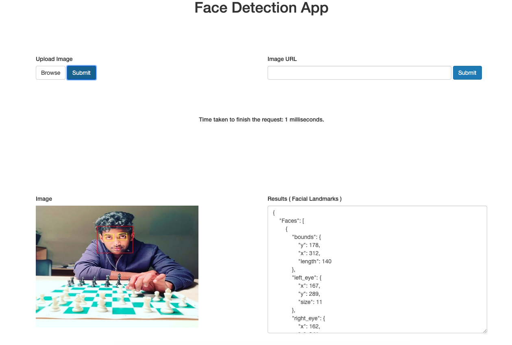
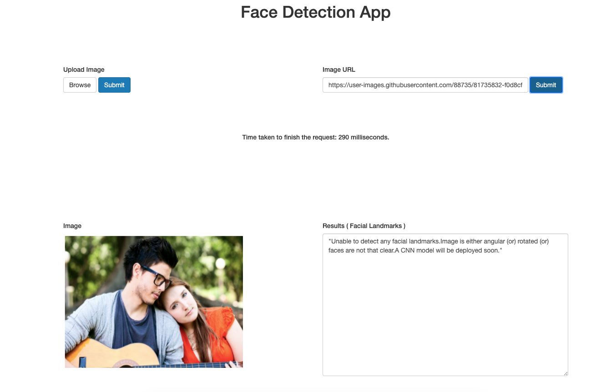

<h1 align="center">Facial Detection API as a Service</h1>

facedetect is a pure Go face detection API which depends on [pigo](https://github.com/esimov/pigp). Thanks to @esimov for his hard work on this.
For more information on pigo, follow the above github source code (or) read this paper (https://arxiv.org/pdf/1305.4537.pdf). 

### Demo



### How it works

<i>Note: My knowledge in computer vision is quite minimum. so, please excuse my technical incorrectness if that occurs.</i>

Object recognition is the most popular topic in computer vision and has been there for decades. First came the wave of custom handmade models and then the wave of deep learning. Currrent implementation supports a hybrid model which takes the best out of both.

##### Pixel Intensity Comparison-based Object detection
Classical models like [Viola Jones](https://en.wikipedia.org/wiki/Viola%E2%80%93Jones_object_detection_framework) have made object detection scalable. It sacrifice certain degree of accuracy for speed. Angular faces ( Faces which turned left (or) right (or) up (or) down) cannot be detected.

Current model is modification to the above Viola Jones but also supports angular faces to a certain amount of accuracy. It scans the image using binary cascade classifiers at all reasonable positions and scales. Each binary classifier itself is an ensemble of decision trees with pixel intensity comparisons at their internal nodes. An image region is considered having face if it passes the above pixel intensity test with all the cascade members.


## Install
Install Go, set your `GOPATH`, and make sure `$GOPATH/bin` is on your `PATH`.

```bash
$ export GOPATH="$HOME/go"
$ export PATH="$PATH:$GOPATH/bin"
```
Next download the project and build the binary file.

Create a temporary directory to store images locally

```bash
$ mkdir -p /tmp/images/temporary
$ mkdir -p /tmp/images/out 
```

Make sure that you install redis in your local machine. It's not necessary but recommended.

For MacOS
```bash
$ brew install redis
$ redis-server 
```

```bash
$ go get -u -f github.com/rohith2506/facedetect
$ go build
$ ./facedetect
```

You can access the web UI at http://localhost:8000 in your web browser

## Directory Structure

```
facedetect
│   README.md
│
└───redis
│   │   redis.go
│   │   redis_test.go
|
└───templates
|   │   index.html
|
└───detector
    │   detector.go
|
└───server.go
└───server_test.go
|
└───utilities
    │  utilities.go
    │  utilities_test.go
```

## Architecture

Architecture is quite simple and minimalistic.

1. Client uses either upload (or) url to submit the image
2. Check the cache ( Redis ) for any duplicates. if it's a cache hit, return the value. We compare the images by creating a md5 hash of the image.
3. Process the algorithm. Store the facial landmarks data along with modified image location path in cache.
4. Client response is the json of facial landmarks data as json and modified image location path
5. Render the image as a static asset along with facial landmarks data

## Caveats

1. As the training data is mostly made up of plane faces, it's hard to recognize angular faces. For example,



There's a workaround for this. We can run the algorithm for every possible combination of angle from 0.0 to 1.0, return the best possible result. But that will have a huge performance impact.

2. Populare deep learning pretrained models like resnet50 are either available in python (or) c which makes it a bit tricky to write bindings

3. Currently images are being stored at `/tmp/images/out`. This can be moved away from application to s3 (or) any other multimedia storage.


## Conclusions / Future Work
This module can act like a blueprint on how to build production level machine learning API as a service. 

Future work includes
1. Integrate / build modules which support pretrained deep learning models to infer / predict from.
2. Dockerize it such that all dependencies coupled together in one single image. This is especially useful if we chose to write bindings and needs to install third party libraries such as OpenCV etc..
3. Realtime facial detection.

## Author

* Rohith Uppala
