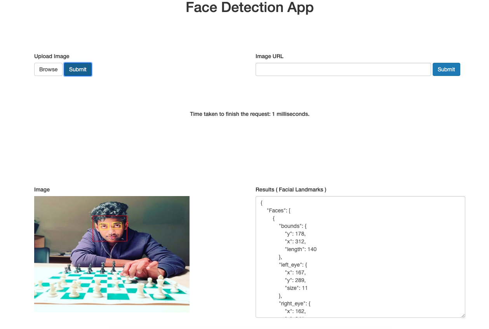

<h1 align="center">Facial Detection API as a Service</h1>

facedetect is a pure Go face detection API which depends on [pigo](https://github.com/esimov/pigp). Thanks to @esimov for his hard work on this.
For more information on pigo, follow the above github source code (or) read this paper (https://arxiv.org/pdf/1305.4537.pdf). 

### Demo



### Explanation


## Install
Install Go, set your `GOPATH`, and make sure `$GOPATH/bin` is on your `PATH`.

```bash
$ export GOPATH="$HOME/go"
$ export PATH="$PATH:$GOPATH/bin"
```
Next download the project and build the binary file.

Please also make sure that you install redis in your local machine. It's not necessary but recommended.

For MacOS
```bash
$ brew install redis
$ redis-server 
```

```bash
$ go get -u -f github.com/rohith2506/facedetect
$ go build
$ ./facedetect
```

You can access the web UI at http://localhost:8000 in your web browser

## Author

* Rohith Uppala
